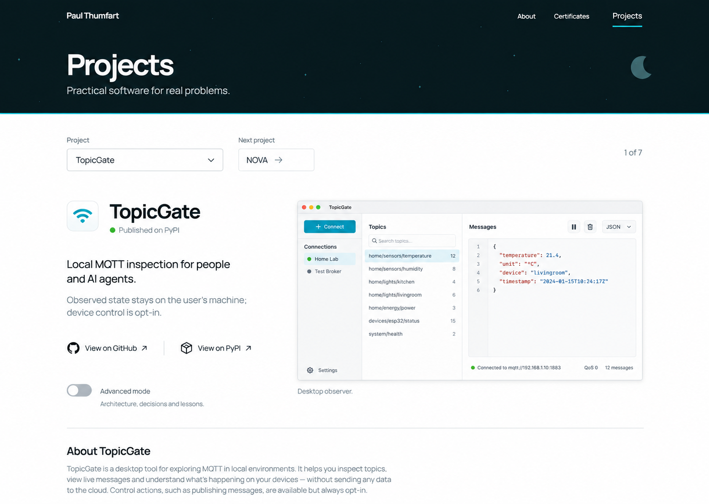
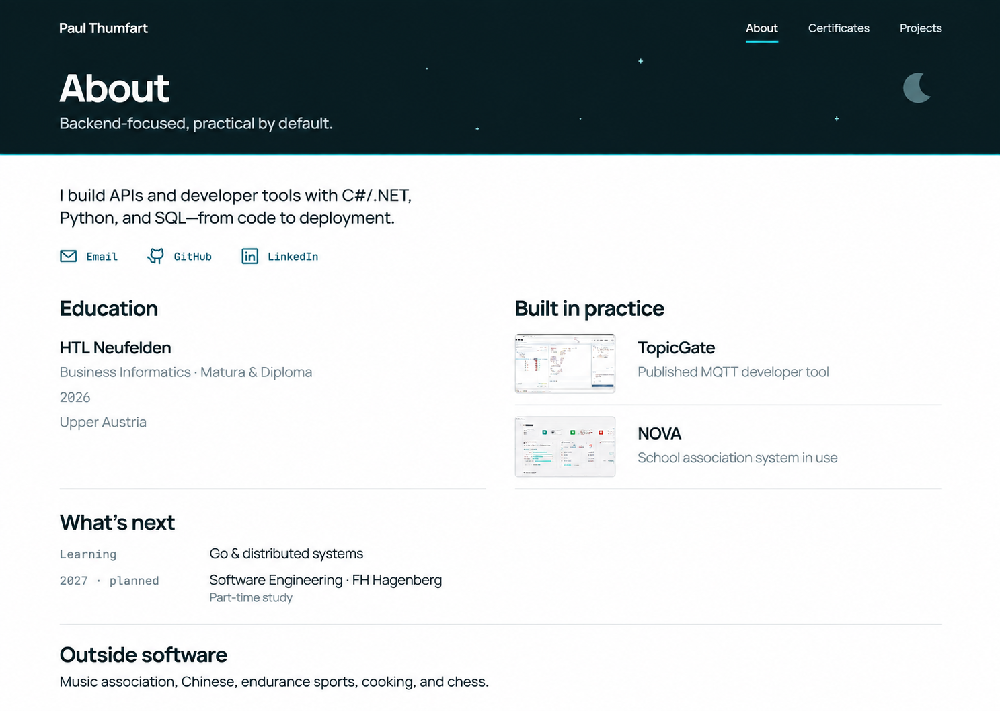
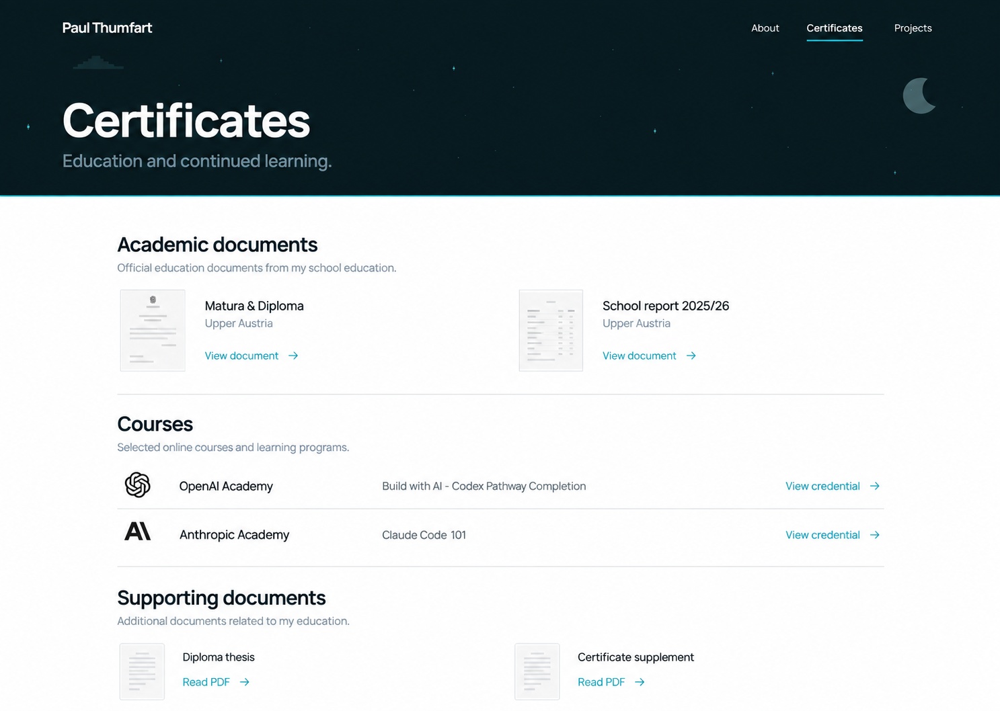

# Horizontal-header explorations

Generated 2026-09-26. Saved design frameworks for implementation and review.
These three pages explore one shared design direction rather than three
competing site identities. Paul's supplied current About screenshot informed
palette, typography and sky treatment; the new direction uses a horizontal
masthead and straight boundary.

## Projects

Demonstrates compact selection, full content width and restrained presentation.
Use the stacked story-then-image order in the written specification rather than
this image's wide-screen side-by-side arrangement.
The generated screenshot and icon are illustrative. The final product must use
actual approved assets. Generated copy is not approved content; obtain missing personal motivation from Paul.
The generated extra About TopicGate paragraph repeats the summary and is not a
requirement. Core explanation should precede optional detail in logical reading order.

## About

Tests the shared shell with a personal introduction and light two-column content.
Existing internships and links remain required even when absent from this frame.
Project thumbnails in the generated image are not replacement source assets.

## Certificates

Tests clear academic/course/supporting-document groups. Rendered paper previews
and issuer marks are illustrative only; reuse approved redacted documents and
existing accurate issuer assets. Preserve omitted supporting documents, including
the diploma certificate explanation, outside this mockup's visible inventory.

## Limits

The images are not browser captures, final copy, evidence of project behavior or
completed responsive/accessibility checks. Their masthead heights and margins
vary; implementation must normalize the shared geometry. The written
[detail-view specification](../../design/detail-view-system.md) is authoritative.
